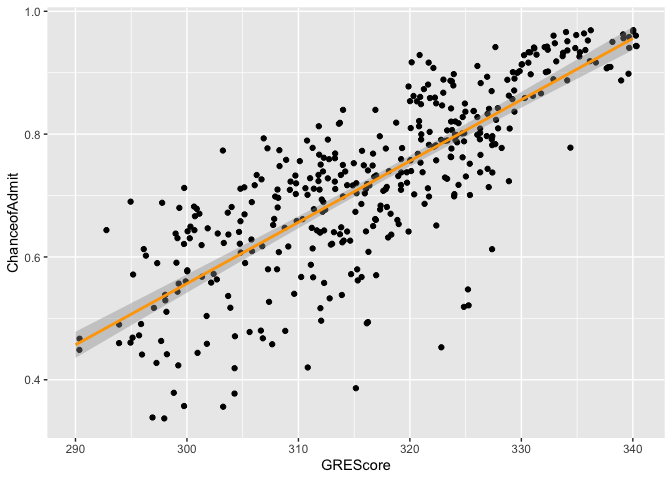
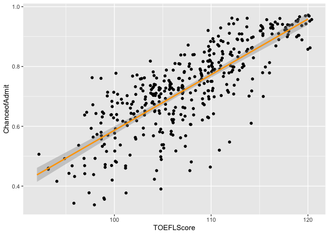
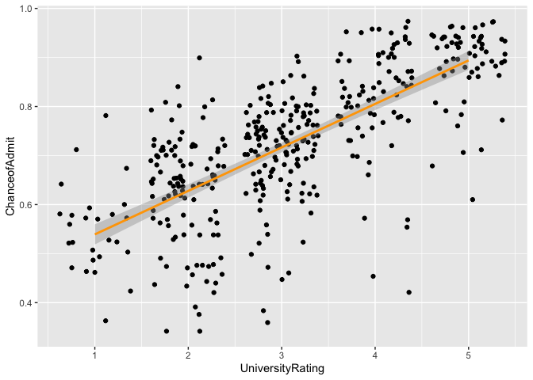
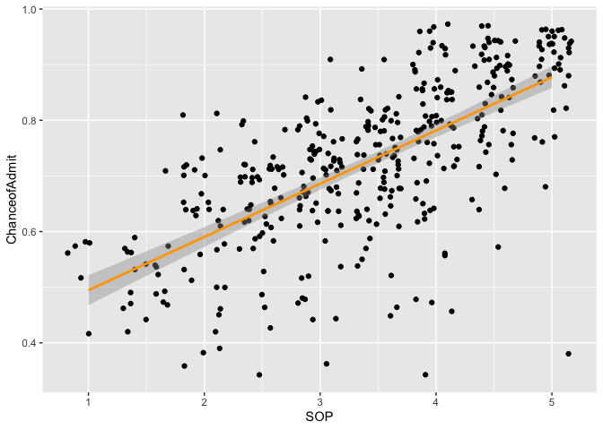
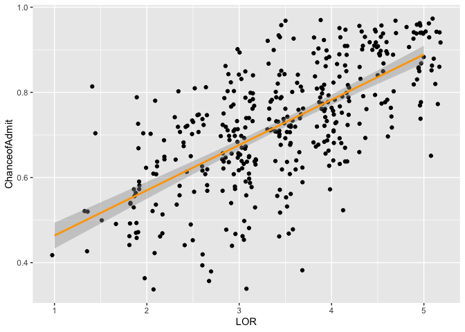
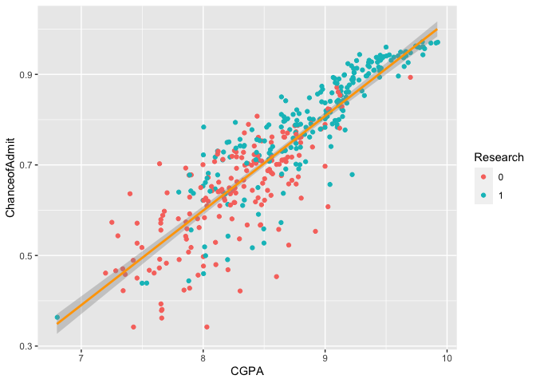

porfolio 5
================

``` r
library(tidyverse)
```

    ## ── Attaching packages ─────────────────────────────────────── tidyverse 1.3.0 ──

    ## ✓ ggplot2 3.3.3     ✓ purrr   0.3.4
    ## ✓ tibble  3.1.0     ✓ dplyr   1.0.4
    ## ✓ tidyr   1.1.2     ✓ stringr 1.4.0
    ## ✓ readr   1.4.0     ✓ forcats 0.5.1

    ## ── Conflicts ────────────────────────────────────────── tidyverse_conflicts() ──
    ## x dplyr::filter() masks stats::filter()
    ## x dplyr::lag()    masks stats::lag()

``` r
library(readr)
library(dplyr)
Admission <- read_csv("Admission.csv")
```

    ## 
    ## ── Column specification ────────────────────────────────────────────────────────
    ## cols(
    ##   `Serial No.` = col_double(),
    ##   GREScore = col_double(),
    ##   TOEFLScore = col_double(),
    ##   UniversityRating = col_double(),
    ##   SOP = col_double(),
    ##   LOR = col_double(),
    ##   CGPA = col_double(),
    ##   Research = col_double(),
    ##   ChanceofAdmit = col_double()
    ## )

“The dataset is retrieved from Kaggle by Mohan S Acharya. Inspired by
lab 9 & 10, my goal of this portfolio is to investigate predictors of
students’ chance of admission.”

``` r
#GRE Scores ( out of 340 )
#TOEFL Scores ( out of 120 )
#University Rating ( out of 5 )
#Statement of Purpose and Letter of Recommendation Strength ( out of 5 )
#Undergraduate GPA ( out of 10 )
#Research Experience ( either 0 or 1 )
#Chance of Admit ( ranging from 0 to 1 )
```

“It should be stated that the chance of admit is also obtained from
students. Researchers have asked them how confident that they think they
will be admitted based on the information they provided. It will be
quite interesting if I can compare their chance of admit to their actual
admission status. However, I failed to find any actual admission
dataset. Therefore, I would like to explore which variable will predict
the student’s self-rated chance of admit.”

### 1. Visual glimpse at the relationship between each predictor and students’ chance of admit.

``` r
ggplot(Admission, aes(x = GREScore,
                      y = ChanceofAdmit)) +
  geom_jitter() +
  stat_smooth(method = lm, color = "orange")
```

    ## `geom_smooth()` using formula 'y ~ x'

<!-- -->

``` r
ggplot(Admission, aes(x = TOEFLScore,
                      y = ChanceofAdmit)) +
  geom_jitter() +
  stat_smooth(method = lm, color = "orange")
```

    ## `geom_smooth()` using formula 'y ~ x'

<!-- -->

“Compared visually, the slopes for GRE and TOEFL are similar and the
positive linear relationship indicates that as their standardized scores
get higher, their confidence of getting admitted is also higher.”

``` r
ggplot(Admission, aes(x = UniversityRating,
                      y = ChanceofAdmit)) +
  geom_jitter() +
  stat_smooth(method = lm, color = "orange")
```

    ## `geom_smooth()` using formula 'y ~ x'

<!-- -->

``` r
ggplot(Admission, aes(x = SOP,
                      y = ChanceofAdmit)) +
  geom_jitter() +
  stat_smooth(method = lm, color = "orange")
```

    ## `geom_smooth()` using formula 'y ~ x'

<!-- -->

``` r
ggplot(Admission, aes(x = LOR,
                      y = ChanceofAdmit)) +
  geom_jitter() +
  stat_smooth(method = lm, color = "orange")
```

    ## `geom_smooth()` using formula 'y ~ x'

<!-- -->

``` r
Admission$Research <- factor(Admission$Research)
ggplot(Admission, aes(x = CGPA,
                      y = ChanceofAdmit,
                      color = Research)) +
  geom_jitter() +
   stat_smooth(method = lm, color = "orange")
```

    ## `geom_smooth()` using formula 'y ~ x'

<!-- -->

“As shown in the diagrams, all indicators are positively correlated with
the chance of admit. For students who have higher GPA and have
researcher experience, their chance of admit also increase.”

### 2. Simple linear regression

``` r
m_gpa <- lm(data = Admission, ChanceofAdmit ~ CGPA)
summary(m_gpa)
```

    ## 
    ## Call:
    ## lm(formula = ChanceofAdmit ~ CGPA, data = Admission)
    ## 
    ## Residuals:
    ##       Min        1Q    Median        3Q       Max 
    ## -0.274575 -0.030084  0.009443  0.041954  0.180734 
    ## 
    ## Coefficients:
    ##             Estimate Std. Error t value Pr(>|t|)    
    ## (Intercept) -1.07151    0.05034  -21.29   <2e-16 ***
    ## CGPA         0.20885    0.00584   35.76   <2e-16 ***
    ## ---
    ## Signif. codes:  0 '***' 0.001 '**' 0.01 '*' 0.05 '.' 0.1 ' ' 1
    ## 
    ## Residual standard error: 0.06957 on 398 degrees of freedom
    ## Multiple R-squared:  0.7626, Adjusted R-squared:  0.762 
    ## F-statistic:  1279 on 1 and 398 DF,  p-value: < 2.2e-16

“for each additional increase in the GPA, the chance of admit is
expected to be higher, on average, by 0.2. If the student gets a 0 in
GPA, he/she will receive a -1.07 chance of admit. (it does not make
sense because 0 in GPA does not have meaning and the chance of admission
should not be negative/over 1.) GPA accounts for 76.2% of the variance
in chance of admit.”

``` r
m_gre <- lm(data = Admission, ChanceofAdmit ~ GREScore)
summary(m_gre)
```

    ## 
    ## Call:
    ## lm(formula = ChanceofAdmit ~ GREScore, data = Admission)
    ## 
    ## Residuals:
    ##      Min       1Q   Median       3Q      Max 
    ## -0.33613 -0.04604  0.00408  0.05644  0.18339 
    ## 
    ## Coefficients:
    ##               Estimate Std. Error t value Pr(>|t|)    
    ## (Intercept) -2.4360842  0.1178141  -20.68   <2e-16 ***
    ## GREScore     0.0099759  0.0003716   26.84   <2e-16 ***
    ## ---
    ## Signif. codes:  0 '***' 0.001 '**' 0.01 '*' 0.05 '.' 0.1 ' ' 1
    ## 
    ## Residual standard error: 0.08517 on 398 degrees of freedom
    ## Multiple R-squared:  0.6442, Adjusted R-squared:  0.6433 
    ## F-statistic: 720.6 on 1 and 398 DF,  p-value: < 2.2e-16

``` r
m_toefl <- lm(data = Admission, ChanceofAdmit ~ TOEFLScore)
summary(m_toefl)
```

    ## 
    ## Call:
    ## lm(formula = ChanceofAdmit ~ TOEFLScore, data = Admission)
    ## 
    ## Residuals:
    ##      Min       1Q   Median       3Q      Max 
    ## -0.31252 -0.05128  0.01328  0.05453  0.21067 
    ## 
    ## Coefficients:
    ##               Estimate Std. Error t value Pr(>|t|)    
    ## (Intercept) -1.2734005  0.0774217  -16.45   <2e-16 ***
    ## TOEFLScore   0.0185993  0.0007197   25.84   <2e-16 ***
    ## ---
    ## Signif. codes:  0 '***' 0.001 '**' 0.01 '*' 0.05 '.' 0.1 ' ' 1
    ## 
    ## Residual standard error: 0.08725 on 398 degrees of freedom
    ## Multiple R-squared:  0.6266, Adjusted R-squared:  0.6257 
    ## F-statistic: 667.9 on 1 and 398 DF,  p-value: < 2.2e-16

``` r
m_rating <- lm(data = Admission, ChanceofAdmit ~ UniversityRating)
summary(m_rating)
```

    ## 
    ## Call:
    ## lm(formula = ChanceofAdmit ~ UniversityRating, data = Admission)
    ## 
    ## Residuals:
    ##      Min       1Q   Median       3Q      Max 
    ## -0.38527 -0.04560  0.01473  0.06341  0.27209 
    ## 
    ## Coefficients:
    ##                  Estimate Std. Error t value Pr(>|t|)    
    ## (Intercept)      0.450537   0.014463   31.15   <2e-16 ***
    ## UniversityRating 0.088684   0.004393   20.19   <2e-16 ***
    ## ---
    ## Signif. codes:  0 '***' 0.001 '**' 0.01 '*' 0.05 '.' 0.1 ' ' 1
    ## 
    ## Residual standard error: 0.1004 on 398 degrees of freedom
    ## Multiple R-squared:  0.5059, Adjusted R-squared:  0.5046 
    ## F-statistic: 407.5 on 1 and 398 DF,  p-value: < 2.2e-16

``` r
m_sop <- lm(data = Admission, ChanceofAdmit ~ SOP)
summary(m_sop)
```

    ## 
    ## Call:
    ## lm(formula = ChanceofAdmit ~ SOP, data = Admission)
    ## 
    ## Residuals:
    ##      Min       1Q   Median       3Q      Max 
    ## -0.49748 -0.05392  0.01823  0.07037  0.22393 
    ## 
    ## Coefficients:
    ##             Estimate Std. Error t value Pr(>|t|)    
    ## (Intercept) 0.398942   0.018556   21.50   <2e-16 ***
    ## SOP         0.095708   0.005233   18.29   <2e-16 ***
    ## ---
    ## Signif. codes:  0 '***' 0.001 '**' 0.01 '*' 0.05 '.' 0.1 ' ' 1
    ## 
    ## Residual standard error: 0.1053 on 398 degrees of freedom
    ## Multiple R-squared:  0.4566, Adjusted R-squared:  0.4552 
    ## F-statistic: 334.4 on 1 and 398 DF,  p-value: < 2.2e-16

``` r
m_lor <- lm(data = Admission, ChanceofAdmit ~ LOR)
summary(m_lor)
```

    ## 
    ## Call:
    ## lm(formula = ChanceofAdmit ~ LOR, data = Admission)
    ## 
    ## Residuals:
    ##      Min       1Q   Median       3Q      Max 
    ## -0.34940 -0.06256  0.00060  0.07389  0.29325 
    ## 
    ## Coefficients:
    ##             Estimate Std. Error t value Pr(>|t|)    
    ## (Intercept) 0.357256   0.021072   16.95   <2e-16 ***
    ## LOR         0.106327   0.005907   18.00   <2e-16 ***
    ## ---
    ## Signif. codes:  0 '***' 0.001 '**' 0.01 '*' 0.05 '.' 0.1 ' ' 1
    ## 
    ## Residual standard error: 0.106 on 398 degrees of freedom
    ## Multiple R-squared:  0.4488, Adjusted R-squared:  0.4474 
    ## F-statistic:   324 on 1 and 398 DF,  p-value: < 2.2e-16

“With the results of the simple linear regressions, it is shown that the
adjusted R squared of GPA (76.2%) &gt; GRE (64.3%) &gt; TOEFL (62.6%)
&gt; university rating (50.4%) &gt; SOP (45.4%) &gt; LOR （44.7%). These
results are also significant, suggesting that all variables are robust
predictors of students’ chance of admit.”

### 3. Multiple regression

``` r
m_admission <- lm(data = Admission, ChanceofAdmit ~ GREScore+TOEFLScore+UniversityRating+SOP+LOR+CGPA+Research)
summary(m_admission)
```

    ## 
    ## Call:
    ## lm(formula = ChanceofAdmit ~ GREScore + TOEFLScore + UniversityRating + 
    ##     SOP + LOR + CGPA + Research, data = Admission)
    ## 
    ## Residuals:
    ##      Min       1Q   Median       3Q      Max 
    ## -0.26259 -0.02103  0.01005  0.03628  0.15928 
    ## 
    ## Coefficients:
    ##                    Estimate Std. Error t value Pr(>|t|)    
    ## (Intercept)      -1.2594325  0.1247307 -10.097  < 2e-16 ***
    ## GREScore          0.0017374  0.0005979   2.906  0.00387 ** 
    ## TOEFLScore        0.0029196  0.0010895   2.680  0.00768 ** 
    ## UniversityRating  0.0057167  0.0047704   1.198  0.23150    
    ## SOP              -0.0033052  0.0055616  -0.594  0.55267    
    ## LOR               0.0223531  0.0055415   4.034  6.6e-05 ***
    ## CGPA              0.1189395  0.0122194   9.734  < 2e-16 ***
    ## Research1         0.0245251  0.0079598   3.081  0.00221 ** 
    ## ---
    ## Signif. codes:  0 '***' 0.001 '**' 0.01 '*' 0.05 '.' 0.1 ' ' 1
    ## 
    ## Residual standard error: 0.06378 on 392 degrees of freedom
    ## Multiple R-squared:  0.8035, Adjusted R-squared:    0.8 
    ## F-statistic: 228.9 on 7 and 392 DF,  p-value: < 2.2e-16

``` r
m_admission_fit <- lm(data = Admission, ChanceofAdmit ~ GREScore+TOEFLScore+LOR+CGPA+Research)
summary(m_admission_fit)
```

    ## 
    ## Call:
    ## lm(formula = ChanceofAdmit ~ GREScore + TOEFLScore + LOR + CGPA + 
    ##     Research, data = Admission)
    ## 
    ## Residuals:
    ##       Min        1Q    Median        3Q       Max 
    ## -0.263542 -0.023297  0.009879  0.038078  0.159897 
    ## 
    ## Coefficients:
    ##               Estimate Std. Error t value Pr(>|t|)    
    ## (Intercept) -1.2984636  0.1172905 -11.070  < 2e-16 ***
    ## GREScore     0.0017820  0.0005955   2.992  0.00294 ** 
    ## TOEFLScore   0.0030320  0.0010651   2.847  0.00465 ** 
    ## LOR          0.0227762  0.0048039   4.741 2.97e-06 ***
    ## CGPA         0.1210042  0.0117349  10.312  < 2e-16 ***
    ## Research1    0.0245769  0.0079203   3.103  0.00205 ** 
    ## ---
    ## Signif. codes:  0 '***' 0.001 '**' 0.01 '*' 0.05 '.' 0.1 ' ' 1
    ## 
    ## Residual standard error: 0.06374 on 394 degrees of freedom
    ## Multiple R-squared:  0.8027, Adjusted R-squared:  0.8002 
    ## F-statistic: 320.6 on 5 and 394 DF,  p-value: < 2.2e-16

"Putting all predictors into the model, it is surprising that university
rating and LOP are no longer signifcant. The adjusted R-squared is
almost 80%, suggesting that this multiple regression appropriately
predicts one’s self-evaluation on his/her chance of admission. Hence,
the best fit model is: Chance of admit = 0.002 (GRE score) + 0.003
(TOEFL score) + 0.024 (LOR) + CGPA (0.123) + 0.025 (Research) - 1.463.

It is a little surprising that students pay more attention to their GPA,
GRE and TOEFL scores (as these adjusted R-squared are so high that these
variables account the majority variance of their chance of admit) than
research experience and letter of recommendation. I went back to the
dataset and realized that it was an indian sample. From my perspective,
students from Asia tend to focus extensively on getting high grades on
the standardized tests. Maybe there will be less uncertainties in
studying on tests compared to research quality and strength of the
recommendation letters (both may depend on other things/people). I
wonder if this conclusion would replicate in Western countries or there
could be some cultural differences!"
